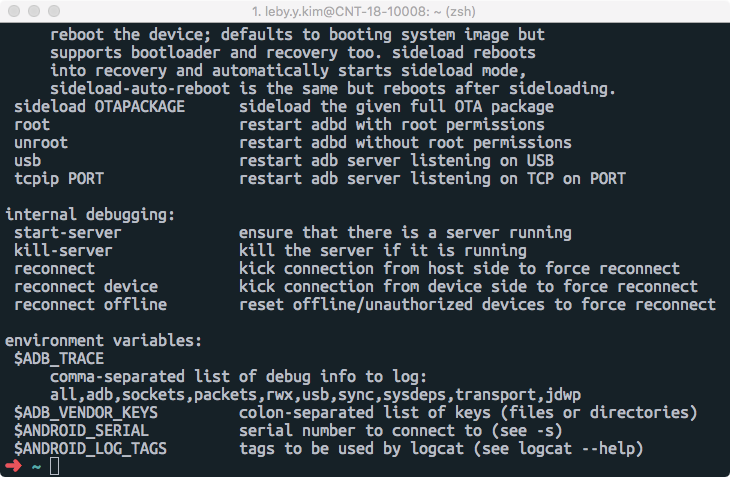

안드로이드 apk를 설치하거나, 삭제할 때 adb 명령어를 이용하면 스마트 폰을 건들지 않고

터미널에서 키보드 입력으로 편리하게 할 수 있다.

먼저 Widnows, Mac 터미널 환경에서 사용하기 위해서는 경로(Path)를 잡아주어야 한다.

 

 

# ADB 환경 설정

안드로이드 스튜디오나, Eclipse에서 ADT를 설치했을 경우 해당 경로로 이동한다.

Android > sdk > platform-tools로 이동하면 adb 파일이 있을 것이다.

**Windows adb 설정**

~~~~
1. 내 컴퓨터 오른쪽 마우스 클릭 > 속성
2. 좌측에 고급 시스템 설정 클릭
3. 고급 탭에 아래쪽 환경 변수 클릭
4. 아래 시스템 변수(S)에서 Path 클릭 후 편집
5. 기존 내용은 절대로 건들지 말고, 끝에다가 ;C:\안드로이드 디렉터리\sdk\platform-tools/adb 추가 확인
6. 윈도우키 + R 눌러 cmd를 실행시켜 adb 명령어를 입력했을 때 제대로 동작하는지 확인
~~~~

 

**MacOS adb 설정**

bash를 사용하는 경우 **~/.bashrc**

Oh My ZSH를 사용하는 경우 **~/.zshrc**

터미널을 실행시켜서 아래 명령어를 추가하고 저장한 뒤 터미널을 종료했다가 다시 실행시킨다.

~~~~bash
export ANDROID_HOME=/Users/$USER/Library/Android/sdk
export PATH=${PATH}:$ANDROID_HOME/tools:$ANDROID_HOME/platform-tools
~~~~

 

아래와 같이 보인다면 설정이 완료된 것이다.

 

 

# 안드로이드 설정

adb를 이용해서 안드로이드에 apk를 설치하기 위해서는 다음과 같은 조건이 필요하다.

**USB 디버깅 모드 활성화**

안드로이드 설정 > 디바이스 정보 > 빌드번호 항목으로 이동한다.

빌드번호를 7~8회 클릭하면 토스트(개발 설정 완료) 메세지가 뜨며 숨겨있던 개발자 옵션이 메뉴가 보여진다.

개발자 옵션에서 USB 디버깅 항목을 체크를 한다.

 

**PTP 파일 전송 모드** 

데이터 전송이 되는 USB 케이블을 스마트 폰에 연결하고 USB 디버깅을 허용한다.

알림창에 보면 파일 전송 모드를 변경할 수 있고 PTP 파일 전송 모드로 선택한다.

여기까지 따라했으면 모든 설정이 끝났다.

 

 

# ADB .apk Install

 아래 명령어를 입력하면 스마트 폰에 앱을 설치한다.

~~~~bash
adb install 생성된APK이름.apk
~~~~

 

 

# ADB .apk UnInstall

아래 명령어를 입력하면 스마트 폰에 앱을 제거한다.

~~~~bash
adb uninstall (com.leby.adb - package 이름)
~~~~

