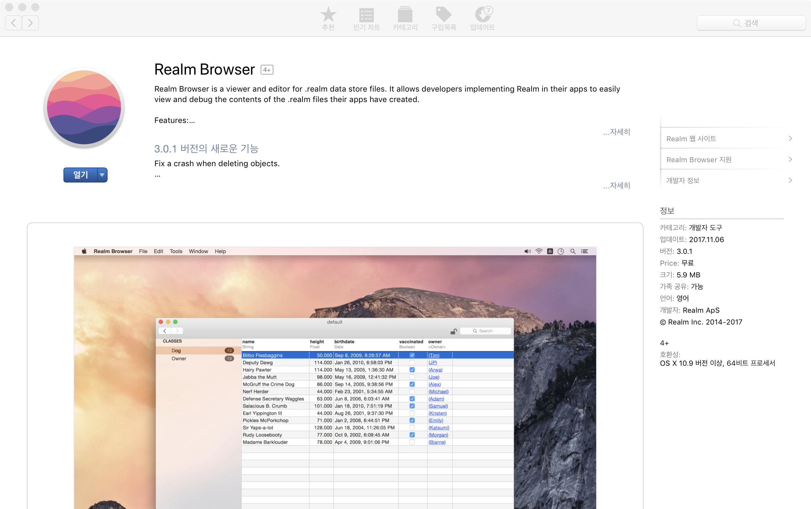

# Android Realm 데이터 확인하기

안드로이드에서 `Emulator`에 Realm 데이터 확인하는 방법에 대해서 정리한다.

 

 

# Realm Browser 설치 (MacOS)

Realm 데이터를 확인하기 위해서는 `.realm` 확장자 포멧을 열어 확인할 수 있는 툴이 필요하다.

`AppStore`에 이동하여 검색창에 `Realm Browser`라고 입력하고 설치한다.

 [**앱스토어 다운로드**](https://itunes.apple.com/kr/app/realm-browser/id1007457278?mt=12)

 

 

# Realm Studio 설치 (Windows, iOS)

Windows 환경에서는 Realm Studio를 이용해서 `.realm`를 확인 할 수 있다.

`Realm Browser`보다 많은 기능을 제공한다. (Query 검색, Admin 기능, Realm 서버 동기화)

[Realm Studio 다운로드](https://realm.io/kr/products/realm-studio/)

 

 

# Emulator Realm 데이터 확인하기

Android Studio에서 Emulator로 실행하는 경우에는 다음과 같이 진행하면 된다. (Kotlin 기준)

그리고 **.realm 파일을 가져오기 위해서는 Emulator가 실행**되어 있어야 한다.

 

**첫번째, .realm 파일의 경로를 구한다.**

~~~kotlin
Log.i("RealmManager",realm.path);
~~~

~~~kotlin
/data/data/io.realm.examples.kotlin/files/default.realm
~~~

Emulator에서 Realm이 저장되는 파일의 위치를 확인할 수 있다.

 

**두번째, 터미널에서 adb 명령을 이용해서 .realm 가져온다.**

adb를 사용하기 위해서는 설정이 먼저 되어있어야 한다.  [adb 설정하기 (Windows, MacOS)](http://app-developer.tistory.com/162?category=284567)

.realm 파일을 가져오기 위해 다음 명령어를 입력한다.

~~~~kotlin
adb pull /data/data/io.realm.examples.kotlin/files/default.realm
~~~~

~~~kotlin
error: failed to stat remote object '/data/data/io.realm.examples.kotlin/files/Account.realm': Permission denied
~~~

위와 같이 에러가 발생한다. 이것은 해당 파일을 가져올 수 있는 권한이 없을 때 발생하는 에러이다.

 

**세번째, adb root로 변경하여 .realm 파일 가져온다.**

권한이 없기에 .realm 파일을 못 가져오니 `adb root`로 전환하여 해당 파일을 가져온다.

터미널에 다음 명령어를 입력하여 root로 전환한다.

~~~kotlin
adb root
~~~

~~~kotlin
restarting adbd as root
~~~

위와 같이 나오면 root 계정으로 전환이 완료된 것이다.

이 상태에서 두번째 항목의 명령어를 입력하면 .realm 파일을 받고 Realm Browser로 실행하면 데이터를 확인할 수 있다.

 

 

# adb root 명령어 에러 발생 하는 경우

~~~kotlin
adbd cannot run as root in production builds
~~~

adb root 명령어 입력했을 때 다음과 같이 error 발생할 수 있다.

**에러 원인**

에러가 발생하는 원인은 `Emulator`에서 `Target`을 `Google Play`로 설정한 경우 다음과 같이 adb root로 변경이 불가능하다.

 

**해결 방법**

Target을 `Google Play`가 아닌 `Google APIs`로 Emulator를 만들면 가능하다.