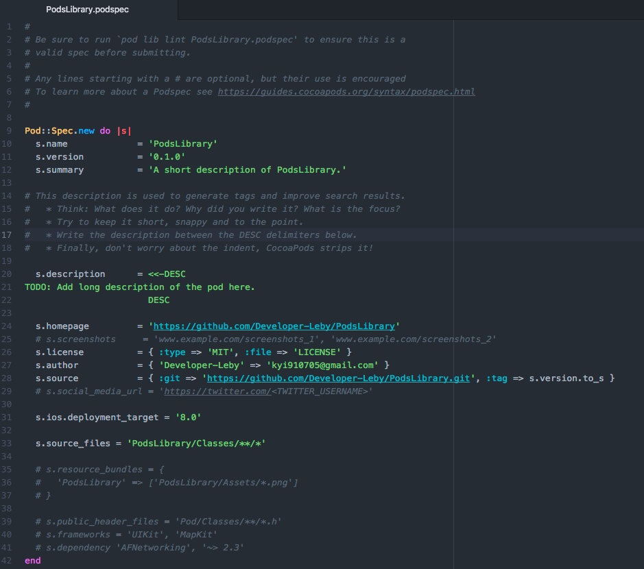
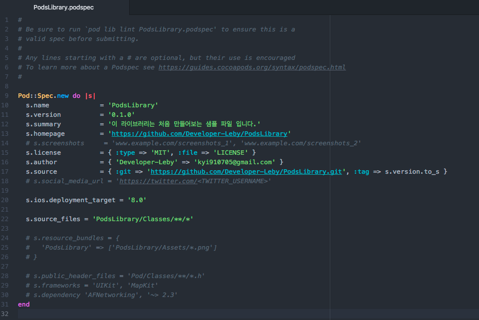
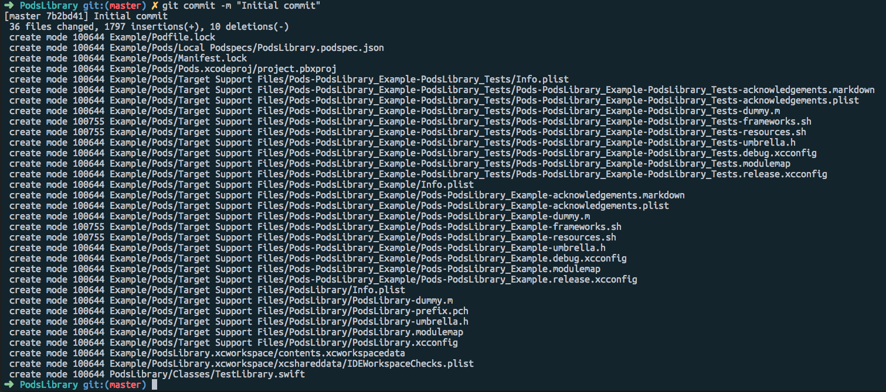
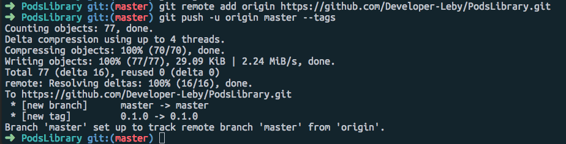
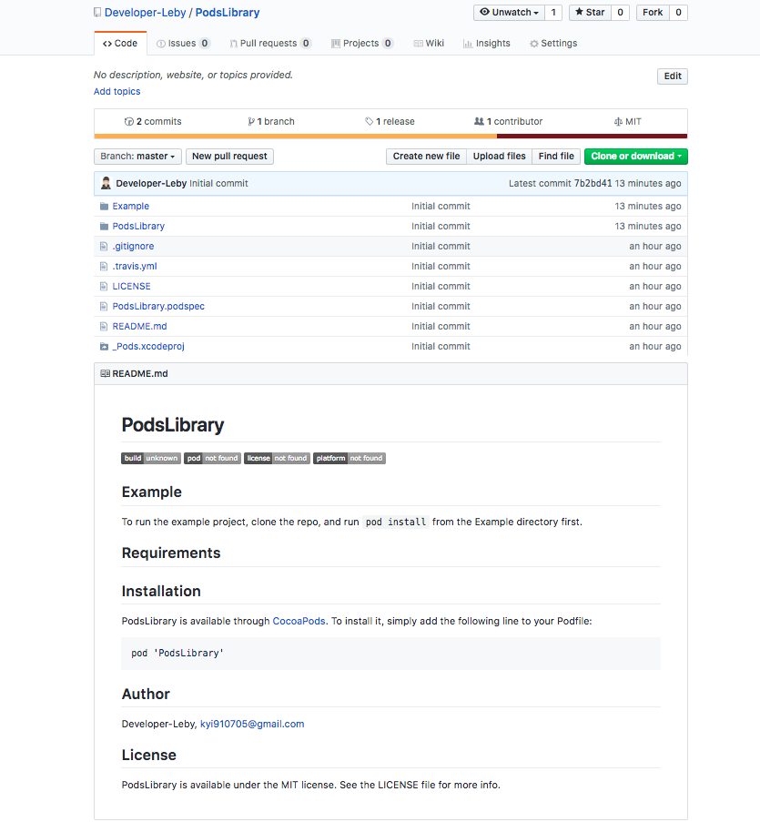
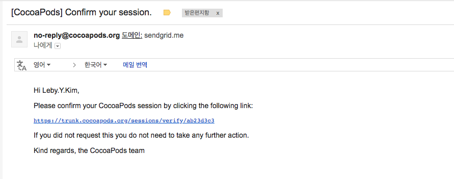
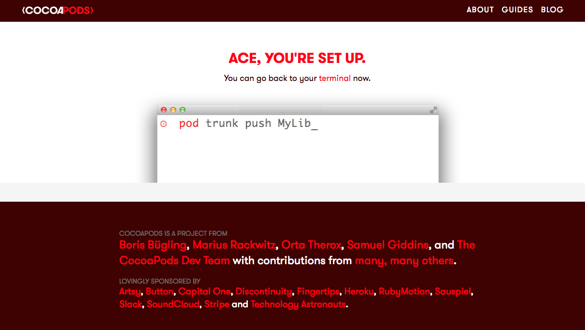
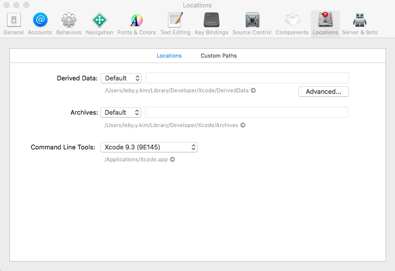
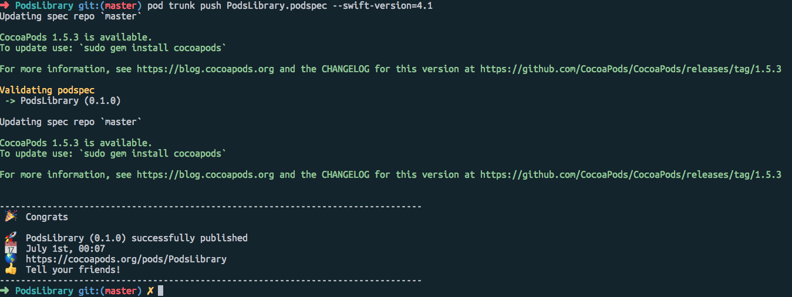
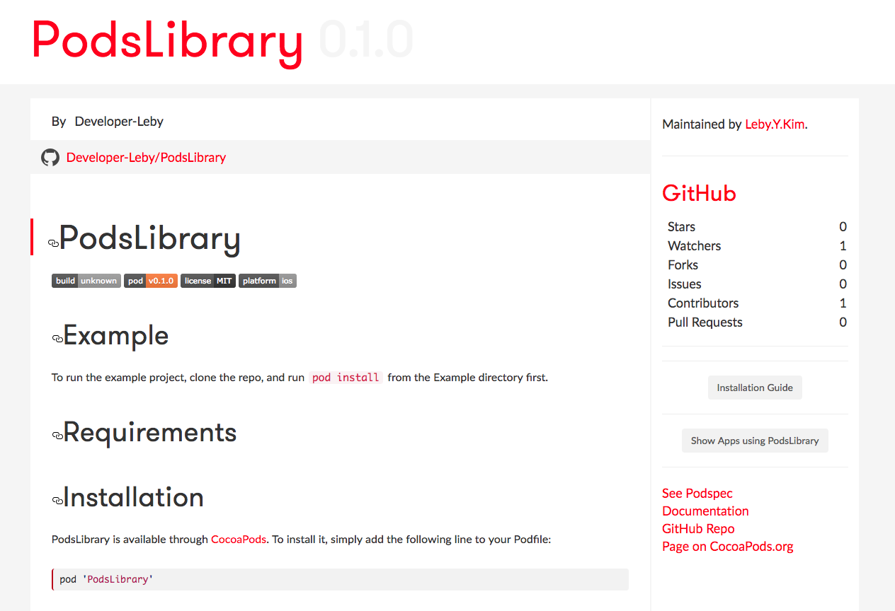

# Cocoapods에 직접 만든 Library 등록 하는 방법

안녕하세요. 레비입니다. 이번에는 직접 만든 라이브러리를 **Cocoapods**에 **Library에** **등록**하는 방법에 대해서 정리하려고 합니다.

cocoapods는 iOS에서 Objective-C, Swift 라이브러리를 설치 및 배포할 수 있도록 도와주는 **의존성 관리 도구**입니다. 일반적으로 사용하는 목적은 다른 개발자가 만든 라이브러리를 사용할 목적으로 사용되지만, 오픈소스에 기여하거나 자신이 필요한 코드들을 모아두고 여러 프로젝트에서 쉽게 사용할 목적으로 등록하기도 합니다.

<br />

**그럼 진행하기에 앞서 먼저 준비되어야 할 항목들이 있습니다. 준비되지 않았다면 진행이 불가합니다.**

- cocoapods 설치 및 사용 방법을 익히셔야 합니다. [cocoapods 설치 및 사용 방법](http://www.developer-leby.kim/125)
- 직접 만든 Pod Library 파일이 있어야 합니다. [Pod Library 생성 및 적용 방법](http://www.developer-leby.kim/180)
- GitHub로 로그인하여 Repository를 생성하실 수 있어야합니다.

<br />

# GitHub Repository 생성

먼저 GitHub로 이동하셔서 Repositories 탭으로 이동해서 New를 눌러 **새로운 레퍼지토리**를 생성합니다. 샘플로 라이브러리를 만들기 때문에 이름을 아무거나 생성해도 됩니다. 저는 `PodsLibrary`로 생성하도록 하겠습니다.


<br />

# .podspec 파일 변경

그리고 아까 프로젝트 라이브러리 폴더로 Finder로 열으셔서 저는 **PodsLibrary**로 폴더를 만들었는데 여기로 이동하시면 `PodsLibrary.podspec ` 이 이름의 파일이 있습니다. 이 파일을 편집기로 열으셔서 다음과 같이 변경해주세요.



편집기로 실행하면 초기 설정 화면입니다. 중요한 항목들만 보자면 다음과 같습니다.

```bash
s.name = 'PodsLibrary'
```

등록할 라이브러리의 이름이고 **GitHub Repo**, **podspec**의 이름이 모두 동일한 이름으로 적용되어야 합니다.

```objc
s.version = '0.1.0'
```

등록할 라이브러리의 버전 정보이고 GitHub의 해당 버전으로 **tag**를 생성해도 됩니다.

```objc
s.summary = 'A short description of PodsLibrary.'
```

라이브러리를 소개하는 짧은 글입니다.

```objc
s.source = { :git => 'https://github.com/Developer-Leby/PodsLibrary.git', :tag => s.version.to_s }
```

등록할 라이브러리가 있는 GitHub Repo 주소입니다. 혹시라도 **Developer-Leby** 이 부분이 **<GITHUB_USERNAME>** 이런식으로 나온다면 GitHub에 자신의 주소로 변경하셔야 합니다.

```objc
s.source_files = 'PodsLibrary/Classes/**/*'
```

등록할 라이브러리의 소스 파일이 있는 경로입니다.

<br />

**저는 s.summary 항목만 수정했습니다.** 추후에 cocoapods에 라이브러리를 등록할 때 s.summary를 바꾸지 않으면 변경해달라고 에러 메세지 뜹니다. 다음과 같은 에러가 발생하니 아래 사진과 같이 s.summary 항목에 대해 변경해주세요.

- **ERROR : summary: The summary is not meaningful.**

~~~bash
Validating podspec
 -> PodsLibrary (0.1.0)
    - WARN  | summary: The summary is not meaningful.
~~~



<br />

# 라이브러리 프로젝트 git 등록

이제 라이브러리가 생성된 프로젝트 PodsLibrary로 이동하셔서 다음 명령어를 입력합니다.

~~~bash
$ git init
~~~

GitHub에 올리기 전에 git관련하여 초기화를 합니다.

~~~bash
$ git add --all
~~~

현재 경로에 있는 모든 파일을 전부 다 add 합니다. (경로: /Users/leby.y.kim/Desktop/CocoaPods/PodsLibrary)

~~~bash
$ git commit -m "Initial commit"
~~~

커밋을 하고 커밋 내용을 입력해줍니다.



정상적으로 커밋이 됐다면 다음과 같은 화면이 보입니다.

다음은 tag를 입력해주어야하는데 .podspec에 정의된 version 정보와 동일하게 입력을 해야 합니다.

~~~bash
s.version = '0.1.0'
~~~

다음 명령어를 입력해서 tag를 등록합니다.

~~~bash
$ git tag 0.1.0
~~~

이제 GitHub에 생성한 레퍼지토리에 remote를 시켜줍니다. 깃허브에서 새로운 레퍼지토리를 만들었을 때 생성된 주소를 복사합니다. (https://github.com/Developer-Leby/PodsLibrary.git) 복사하고 이제 remote를 진행합니다.

~~~bash
$ git remote add origin https://github.com/Developer-Leby/PodsLibrary.git
~~~

git remote 경로를 설정을 해줍니다.

~~~~bash
$ git push -u origin master --tags
~~~~

이제 지정된 경로에 push를 하게 되면 로컬에 있는 Source들이 GitHub에 업로드 됩니다.



업로드가 됐다면 다음과 같은 화면이 나옵니다. 이제 GitHub 페이지에 정말로 Source가 업로드 되었는지 확인해봅니다.



GitHub에 보니 정상적으로 업로드된 것을 확인할 수 있습니다. README.md 파일의 형식은 기본적으로 자동으로 제공해줍니다. 이제 업로드 된 것을 확인 했으니 이제 **CocoPods**에 **등록**하는 일만 남았습니다.

<br />

# CocoaPods Library 등록

이제 CocoaPods에 등록하는 일만 남았습니다. 다음 명령어를 입력해주세요.

~~~bash
$ pod trunk register kyi910705@gmail.com "Leby.Y.Kim"
~~~

CocoaPods를 인증 받는 메일을 입력하고 뒤 쪽에는 이름이나 닉네임을 적어줍니다. 그리고 입력을 하면 작성하신 메일로 CocoaPods에서 메일을 보냈을 겁니다. 메일로 이동해서 메일온 것을 확인해주세요.





메일을 확인하고 해당 주소로 이동하시면 인증이 완료됩니다. 이제 업로드를 시켜봅니다.

~~~bash
$ pod trunk push PodsLibrary.podspec --swift-version=4.1
~~~

이 부분에서 약간의 시간이 소요됩니다. 

- **ERROR : swift: The validator used Swift 3.2 by default because no Swift version was specified.**

~~~bash
Validating podspec
 -> PodsLibrary (0.1.0)
    - WARN  | summary: The summary is not meaningful.
    - WARN  | [iOS] swift: The validator used Swift 3.2 by default because no Swift version was specified. To specify a Swift version during validation, add the `swift_version` attribute in your podspec. Note that usage of the `--swift-version` parameter or a `.swift-version` file is now deprecated.
~~~

Swift 버전을 적어주지 않으면 위와 같은 에러가 발생합니다.

**ERROR : swift: unknown: Encountered an unknown error (/usr/bin/xcrun simctl list -j devices**

~~~bash
Validating podspec
 -> RotateImage (0.1.0)
    - ERROR | [iOS] unknown: Encountered an unknown error (/usr/bin/xcrun simctl list -j devices

xcrun: error: unable to find utility "simctl", not a developer tool or in PATH
) during validation.
~~~

위와 같은 에러가 발생할 경우 Simulator의 Command Line Tools을 지정해줘야 합니다. 

`Command` + `,` 단축키를 누르거나 위에 메뉴에서 Xcode > Preferences..로 Xcode 환경 설정로 이동하여 위에 탭에 Locations로 이동하여 Command Line Tools를 선택해주면 해결 됩니다.



이 외의 다른 이슈가 발생할 확률도 있으니 나머지는 구글링을 통해 찾아보시는게 좋을 것 같습니다.

<br />



터미널에서 아까 입력한 Command가 정상적으로 처리가 되었다면 다음과 같이 축하메세지가 나오면서 CocoaPods에 라이브러리가 등록되었을 겁니다.  축하메세지와 함께 나와있는 URL을 들어가보면 아래 사진과 같이 나오는 것을 확인할 수 있습니다.

<br />

# CocoaPods 라이브러리 등록 화면



https://cocoapods.org/pods/PodsLibrary 

여기까지 잘 따라오셨다면 누구나 다운로드 받을 수 있는 Pod 라이브러리를 만드신 것입니다. 고생하셨습니다~!