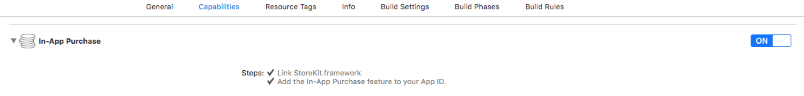
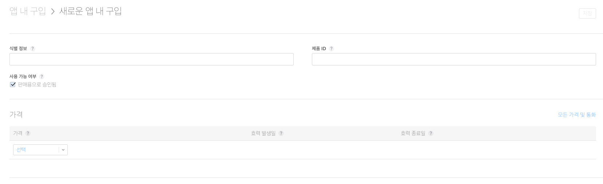
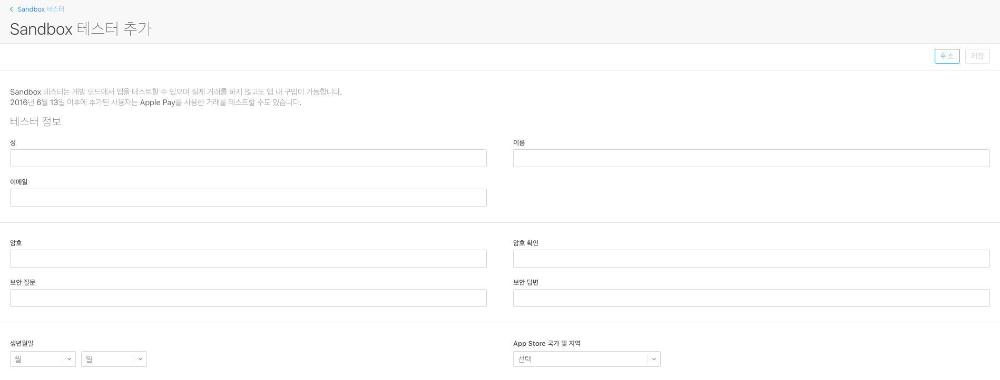

# In-App 기능 활성화

최근 프로젝트에 인앱 구매 기능을 넣고 추후에 까먹을까봐 정리를 하려고한다.

먼저 인앱 기능을 넣고 싶은 프로젝트를 실행해서 Target > Capabillities 속성으로 이동한다.

OFF > ON으로 변경하면 이제부터 이 프로젝트에서는 인앱을 사용할 수 있다.



<br />그리고 애플 개발자 사이트에서 Certificates, Identifiers & Profiles로 이동한다.

좌측 메뉴에서 Identifiers > App IDs에서 현재 인앱을 ON시킨 프로젝트의 번들 아이디 값과 동일한

App IDs를 가진 프로젝트의 정보를 확인한다.

해당 프로젝트의 In-App Purchase 항목이 Enable로 되어 있으면 기본 설정은 끝났다.


<br />

<br />

# In-App Source 구현

먼저 인앱을 구현하기 위해서는 StoreKit이라는 iOS SDK를 이용해야 한다.

Target > Build Phases으로 이동해서 StoreKit Framework 라이브러리를 링크 시킨다.

**InAppViewController.h**

```objc
@interface InAppViewController : UIViewController<
SKProductsRequestDelegate,SKPaymentTransactionObserver> {
    SKProductsRequest *productsRequest;
    NSArray *validProducts;
    IBOutlet UILabel *productTitleLabel;
    IBOutlet UILabel *productDescriptionLabel;
    IBOutlet UILabel *productPriceLabel;
    IBOutlet UIButton *purchaseButton;
    IBOutlet UIButton *restorePurchaseButton;
}

- (void)fetchAvailableProducts;
- (BOOL)canMakePurchases;
- (void)purchaseMyProduct:(SKProduct*)product;
- (IBAction)purchase:(id)sender;
```

<br />

**InAppViewController.m**

```objc
#import <StoreKit/StoreKit.h>
#define kTutorialPointProductID @"com.leby.Test.InApp"
```

> kTutorialPointProductID는 이 시점에서는 모른다. 
>
> Source 구현이 끝나고 itunesconnect 에서 ProductID를 지정해주어야 한다.

```objc
- (void)viewDidLoad {
    [super viewDidLoad];
    // Do any additional setup after loading the view.
    [self fetchAvailableProducts];
}
```

```objc
-(void)fetchAvailableProducts {
    NSSet *productIdentifiers = [NSSet setWithObjects:kTutorialPointProductID,nil];
    productsRequest = [[SKProductsRequest alloc] initWithProductIdentifiers:productIdentifiers];
    productsRequest.delegate = self;
    [productsRequest start];
}
```

```objc
- (BOOL)canMakePurchases {
    return [SKPaymentQueue canMakePayments];
}
```

```objc
- (void)purchaseMyProduct:(SKProduct*)product {
    if ([self canMakePurchases]) {
        SKPayment *payment = [SKPayment paymentWithProduct:product];
        [[SKPaymentQueue defaultQueue] addTransactionObserver:self];
        [[SKPaymentQueue defaultQueue] addPayment:payment];
    } else {
//        NSLog(@"Purchases are disabled in your device");
        [Utils showToastErrorWithTitle:@"Error" message:@"Purchases are disabled in your device" duration:1.5];
        purchaseButton.hidden = YES;
        restorePurchaseButton.hidden = YES;
    }
}
```

```objc
#pragma mark StoreKit Delegate
-(void)paymentQueue:(SKPaymentQueue *)queue updatedTransactions:(NSArray *)transactions {
    for (SKPaymentTransaction *transaction in transactions) {
        switch (transaction.transactionState) {
            case SKPaymentTransactionStatePurchasing:
//                NSLog(@"Purchasing");
                break;
                
            case SKPaymentTransactionStatePurchased:
                if ([transaction.payment.productIdentifier isEqualToString:kTutorialPointProductID]) {
//                    NSLog(@"Purchase is completed succesfully");
                    _SET_BOOL_PREFERENCE(_KEY_APP_ADMOB_HIDE, YES);
                    [Utils showToastInfoWithTitle:@"광고 제거" message:@"배너 광고가 삭제되었습니다." duration:1.5];
                    [self.view removeFromSuperview];
                    [[SKPaymentQueue defaultQueue] finishTransaction:transaction];
                }
                break;
                
            case SKPaymentTransactionStateRestored:
//                NSLog(@"Restored ");
                [[SKPaymentQueue defaultQueue] finishTransaction:transaction];
                break;
                
            case SKPaymentTransactionStateFailed:
//                NSLog(@"Purchase failed ");
                break;
                
            default:
                break;
        }
    }
    dispatch_async(dispatch_get_main_queue(), ^{
        [SVProgressHUD dismiss];
    });
}
```

```objc
-(void)productsRequest:(SKProductsRequest *)request didReceiveResponse:(SKProductsResponse *)response {
    SKProduct *validProduct = nil;
    NSUInteger count = [response.products count];
    
    if (count > 0) {
        validProducts = response.products;
        validProduct = [response.products objectAtIndex:0];
        
        if ([validProduct.productIdentifier
             isEqualToString:kTutorialPointProductID]) {
            [productTitleLabel setText:validProduct.localizedTitle];
            [productDescriptionLabel setText:validProduct.localizedDescription];
            NSString *priceString = [NSString stringWithFormat:@"구매 ($%@)",validProduct.price];
            [purchaseButton setTitle:priceString forState:UIControlStateNormal];
        }
    } else {
        // 아이튠즈커넥트에서 계약 및 세금 금융 거래 항목을 작성하지 않아 발생됐음.
//        NSLog(@"No products to purchase");
        [Utils showToastErrorWithTitle:@"Error" message:@"No products to purchase" duration:1.5];
        purchaseButton.hidden = YES;
        restorePurchaseButton.hidden = YES;
    }
    purchaseButton.hidden = NO;
    restorePurchaseButton.hidden = NO;
    
    [SVProgressHUD dismiss];
}
```

```objc
#pragma mark - 버튼 메서드
-(IBAction)purchase:(id)sender {
    dispatch_async(dispatch_get_main_queue(), ^{
        [SVProgressHUD show];
    });
    
    if (sender == restorePurchaseButton) {
        [Utils showToastInfoWithTitle:@"인앱 알림" message:@"구매내역이 있으시면 구입 눌러도\n추가 금액이 발생하지 않습니다." duration:3];
    }
    
    if (self->validProducts != nil) {
        [self purchaseMyProduct:[self->validProducts objectAtIndex:0]];
    }
}
```

<br />

<br />

# 인앱 제품 추가

이번에는 인앱 상품을 추가한다. itunesconnect 인앱을 추가 시킬 앱으로 이동한다.

나의 앱 > 앱 내 추가 기능 > 앱 내 구입 항목으로 이동한다.

> 나의 앱
>
> > 앱 내 추가 기능
> >
> > > 앱 내 구입

위치로 이동해서 +버튼을 눌러 새로운 상품을 등록한다.

인앱 상품에는 2018.06.07 현재는 총 4가지의 상품이 있다.

- **소모품** (낚시 앱의 물고기 떡밥)
- **비소모품** (게임 앱의 레이스 트랙)
- **자동 갱신 구독** (스트리밍 서비스를 지원하는 앱 월간 구독)
- **비자동 갱신 구독** (아카이브된 기사 카탈로그 1년 구독)

위와 같이 4가지가 있다. 나는 여기에서 2번째 비소모품으로 인앱 상품을 구성하였다.



**식별 정보** : com.leby.Memories.InApp (자신의 앱에 맞게 변경하면 됨)

**제품 ID** : 자신이 마음대로 입력하면 됨 (단, 중복되지 않도록)

**가격** : 원하는 가격에 맞게 설정

★ **판매용으로 승인됨** : 이 부분이 체크 되어있는지 확인 필요 (체크 해제 되어있으면 실제 배포시 인앱 기능 X)

**현지화** : 언어를 지원하는 나라에 맞게 제품 설명하는 것을 변경하면 됨.

**스크린샷** : 구매, 구매복원 등의 앱에서 어떤식으로 보여지는지 스크린샷

------

각 항목에 맞춰 입력하고 저장을 누르면 제품 등록은 끝이다.

<br />

<br />

# 인앱 테스트 계정 추가 (Sandbox 테스터)

인앱 상품에 대해서 구매할 수 있는 테스터 계정을 만들어야 한다.

itunesconnect로 이동해서 사용자 및 역할 > Sandbox 테스터 + 눌러 추가를 해야한다.

> 사용자 및 역할
>
> > Sandbox 테스터



테스트를 진행 할 임의의 이메일 주소를 입력하고 나머지 정보들은 채우면 된다.

근데 여기서 가장 중요한 것은 각각의 조건을 맞추어야 한다.

가끔 애플 페이지가 에러가 나면 별 말 없이 에러가 났다는 문구만 보여준다.

- 암호는 8자에서 32자 사이여야 합니다.
- 보안 질문은 6자에서 35자 사이어야 합니다.
- 보안 답변은 6자에서 35자 사이어야 합니다.
- 해당 이메일 주소는 이미 기존 Apple ID에 연결되어 있습니다.

각 조건에 맞게 작성을 했다면 저장을 눌러 아이디를 생성한다.

<br />

<br />

# TestFlight 인앱 테스트

이제 앱을 테스트 TestFlight에 올려 Sandbox 테스터 계정으로 테스트를 할 수 있다.

테스를 진행하다보면 소스 상에서 다음과 같이 에러를 볼 수 있다.

```objc
No products to purchase
```

<br />

이 부분은 인앱 제품의 대해 정보를 가져오지 못했을 때 발생되는 에러이다.

가져오지 못하는 이유에는 여러가지가 있겠지만, 제가 발생되었던 이슈는 **계약 및 세금 금융 거래** 누락이였다.

인앱 기능을 넣고 판매할 때 입력해야할 필수 항목이다.

인앱을 판매하게되면 일부 수익금을 애플에서부터 받게 된다. 어느 은행이고, 어떤 계좌로 수익금을 받을지를 작성하게 된다.

그래서 **계약 및 세금 금융 거래**가 누락 되었다면 제품을 판매할 수 없는 것이다.

계약 및 세금 금융 거래를 작성을 하시면 정상적으로 인앱 제품이 조회되는 것을 볼 수 있다.

여기까지 했으면 실제 앱을 배포했을 때도 정상적으로 인앱 기능이 동작한다.

<br />

<br />

# 앱 배포시 특이사항

인앱 구매에 대해서 앱스토어 리젝이 난 적이 있다. 

3.1.1 In-App Purchase : 기능 제한의 해제에는 사용 필수이며 인앱결제 이외의 결제방법은 불가한다. 구입한 통화는 만기없이 앱내에서만 소비 가능하며 복구기능 및 청구유형이 잘못된 앱은 불가한다. 청구내용의 선물도 불가한다.

**즉, 구매 버튼만 있으면 되는게 아니라, 구매 복구 버튼도 있어야 된다고 한다.**

하지만 나는 구매 복원 버튼이 있고, 눌렀을 때 똑같이 구매 프로세스로 동작하긴 하지만 비밀번호를 입력하면

복원 프로세스를 돌리는 로직으로 구현이 되어있어 스크린샷과 관련 내용을 다시 전달하였다.

<br />

그렇게 하루가 지나고 iOS에서 앱의 상태를 심사 중으로 변경하고 항목에 대해 확인하고 판매 준비됨으로 상태를 변경해주었다.