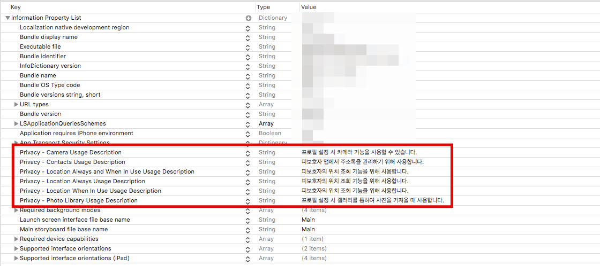
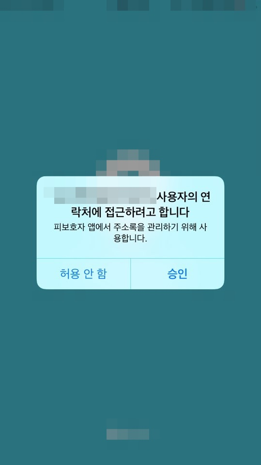

# Privacy iOS 10+ 설정

iOS 10이상에서는 빌드 시에 카메라나 특정 다른 기능을 사용하면 아무런 경고 없이 Crash가 발생하게 된다.

 

디버그 메세지는 다음과 같다.

>This app has crashed because it attempted to access privacy-sensitive data without a 
>
> usage description. The app’s Info.plist must contain an NSCameraUsageDescription key
>
> with a string value explaining to the user how the app uses this data.

iOS 10에서 아래와 같은 기능을 사용하기 위해서는 사용자의 확인 메세지를 설정해줘야 한다.

 

사용 설명을 요구하는 API 항목은 다음과 같다.

| Data Class          | Xcode Key                                                    | Raw Info.plist Key                                           |
| ------------------- | ------------------------------------------------------------ | ------------------------------------------------------------ |
| Apple Music         | Privacy - Media Library Usage Description                    | NSAppleMusicUsageDescription                                 |
| Bluetooth           | Privacy - Bluetooth Peripheral Usage Description             | NSBluetoothPeripheralUsageDescription                        |
| Calendar            | Privacy - Calendars Usage Description                        | NSCalendarsUsageDescription                                  |
| Camera              | Privacy - Camera Usage Description                           | NSCameraUsageDescription                                     |
| Contacts            | Privacy - Contacts Usage Description                         | NSContactsUsageDescription                                   |
| Health              | Privacy - Health Share Usage Description Privacy - Health Update Usage Description | NSHealthShareUsageDescription NSHealthUpdateUsageDescription |
| Home                | Privacy - HomeKit Usage Description                          | NSHomeKitUsageDescription                                    |
| Location            | Privacy - Location Always Usage Description Privacy - Location When In Use Usage Description | NSLocationAlwaysUsageDescription NSLocationWhenInUseUsageDescription |
| Microphone          | Privacy - Microphone Usage Description                       | NSMicrophoneUsageDescription                                 |
| Motion              | Privacy - Motion Usage Description                           | NSMotionUsageDescription                                     |
| Photos              | Privacy - Photo Library Usage Description **Privacy - Photo Library Additions Usage Description** | NSPhotoLibraryUsageDescription **NSPhotoLibraryAdditionsUsageDescription** |
| Reminders           | Privacy - Reminders Usage Description                        | NSRemindersUsageDescription                                  |
| Siri                | Privacy - Siri Usage Description                             | NSSiriUsageDescription                                       |
| Speech Recognition  | Privacy - Speech Recognition Usage Description               | NSSpeechRecognitionUsageDescription                          |
| TV Provider Account | Privacy - TV Provider Usage Description                      | NSVideoSubscriberAccountUsageDescription                     |

 

iOS 11부터는 앨범에 접근할 때 권한 하나를 더 입력해야된다. **Privacy - Photo Library Additions Usage Description**

위 항목에 대해서 `Info.plist` 를 설정하면 된다.

카메라와 앨범, 사용자의 위치 조회에 대한 기능을 사용하기 위해서는 Privacy를 추가하면 된다.

 

이제 소스 코드에서 해당 기능을 사용할 때 권한을 승인 받는 화면이 사용자에게 보여진다.

