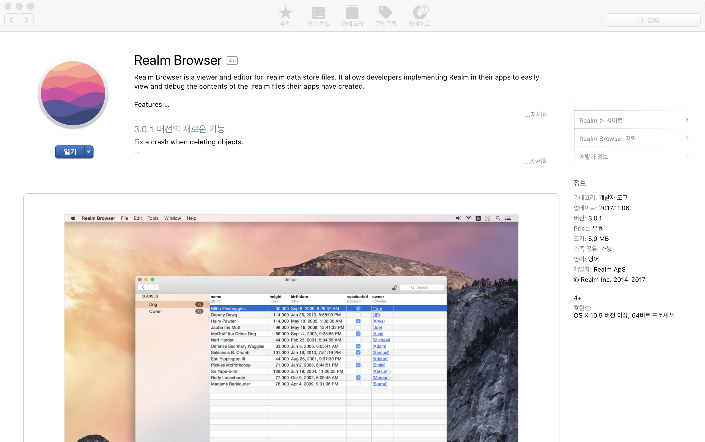
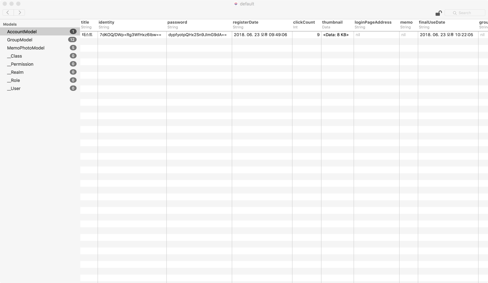
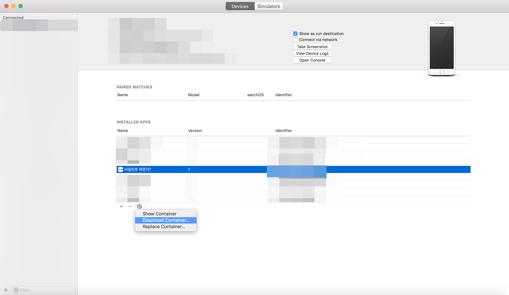

# Realm 데이터 확인하기

iOS에서 Realm 데이터를 확인하는 방법에 대해서 정리한다.

`Simulator`와 실제 `iPhone Device`에서 Realm 확인하는 방법은 다르다.

 

 

# Realm Browser 설치

Realm 데이터를 확인하기 위해서는 `.realm` 확장자 포멧을 열어 확인할 수 있는 툴이 필요하다.

`AppStore`에 이동하여 검색창에 `Realm Browser`라고 입력하고 설치한다.

[앱스토어 다운로드](https://itunes.apple.com/kr/app/realm-browser/id1007457278?mt=12)

 

 

# Simulator에서 데이터 확인

먼저 Xcode에서 `Simulator`로 실행하는 경우는 다음 절차로 진행하면 된다. (ObjectiveC 기준)

**첫번째, .realm 파일의 경로를 구한다.**

~~~objective-c
NSLog(@"%@", [RLMRealmConfiguration defaultConfiguration].fileURL);
~~~

~~~~objective-c
file:///Users/leby.y.kim/Library/Developer/CoreSimulator/Devices/9D76320B-D399-443A-96C7-5811DE60634A/data/Containers/Data/Application/F29970C3-4EFD-4E34-B2FB-539EE5D61895/Documents/default.realm
~~~~

Simulator에서 Realm이 저장되는 파일의 위치를 확인할 수 있다.

 

**두번째, 터미널에서 .realm 파일의 경로를 실행한다.**

직접 경로로 이동하여 실행하는 방법도 있지만, `터미널`을 이용하면 빠르게 실행할 수 있다.

터미널을 실행시켜 위에 `Path`를 `복사`하고 다음과 같이 입력한다.

~~~objc
open file:///Users/leby.y.kim/Library/Developer/CoreSimulator/Devices/9D76320B-D399-443A-96C7-5811DE60634A/data/Containers/Data/Application/F29970C3-4EFD-4E34-B2FB-539EE5D61895/Documents/default.realm
~~~

위 명령어를 입력하면 다음과 같이 실행되고 Realm의 데이터를 확인할 수 있다.

 

 

# iPhone Device에서 Realm 데이터 확인

이번엔 iPhone Device로 실행하는 경우는 다음 절차로 진행하면 된다.

**첫번째, Container 파일 다운로드**

먼저 Xcode 위에 메뉴 항목에서 `Window` > `Devices and Simulator` 항목으로 이동한다.

단축키는 `Shift`+`Command`+`2` 누르면 다음과 같은 화면이 나온다.

`Devices` 탭에서 앱을 선택하고 아래 `톱니바퀴` 모양을 선택하고 `Download Container...`  를 선택한다.

적당한 곳에 Container 파일을 저장하고 Finder로 파일을 저장한 곳으로 이동한다.

 

**두번째, .realm 데이터 확인**

Finder에서 파일을 오른쪽 마우스 클릭하여 `패키지 내용 보기`를 선택한다.

`AppData` > `Documents` > `default.realm` 경로에 파일이 있고 실행하면 Realm 데이터를 확인할 수 있다.

 