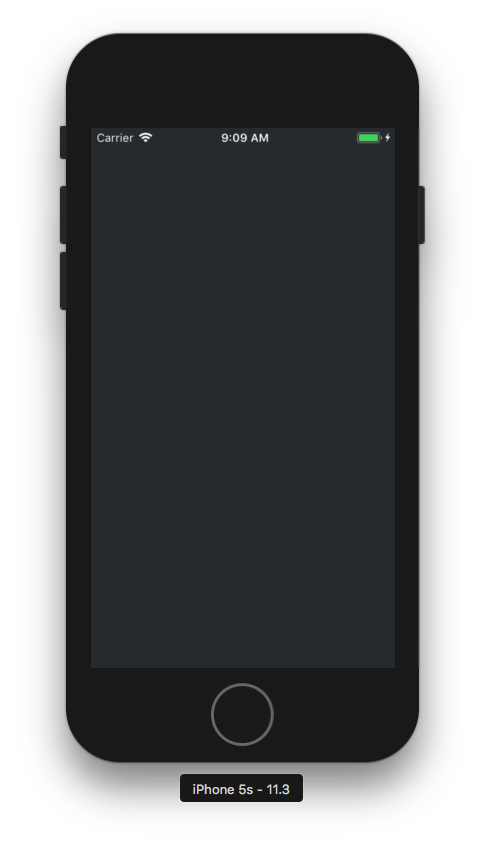
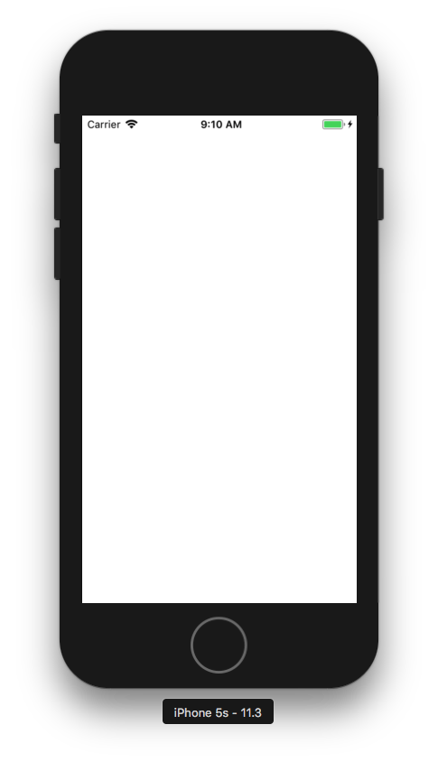

# StatusBar Style 변경

iOS에서 StatusBar Style에는 Dark, Light 2가지의 색상이 있다.

화면별로 StatusBar의 색상을 변경하고 싶으면 다음을 적용해야된다.

###  첫번째,

프로젝트 내에 있는 info.plist의 파일을 열어 Add Row로 다음 항목을 추가한다.

~~~~objc
View controller-based status bar appearance -> NO
~~~~

### 두번째, 

AppDelegate에 다음 코드를 추가하면 StatusBar Style을 원하는 테마로 변경할 수 있다.

**Objective-C**

~~~~objective-c
[[UIApplication sharedApplication] setStatusBarStyle:UIStatusBarStyleLightContent];
~~~~

* UIStatusBarStyleDefault 
* UIStatusBarStyleLightContent

**Swift**

~~~~swift
UIApplication.sharedApplication().statusBarStyle = .LightContent
~~~~

다음과 같이 추가하면 원하는 테마로 변경할 수 있다. 

그리고 다음 메서드를 사용해서도 StatusBar Style을 변경할 수 있다.

**Objective-C**

~~~~objective-c
- (UIStatusBarStyle)preferredStatusBarStyle {
    return UIStatusBarStyleLightContent;
}
~~~~

**Swift**

~~~~swift
override func preferredStatusBarStyle() -> UIStatusBarStyle {
    return UIStatusBarStyle.LightContent
}
~~~~

다음 메서드를 이용해서도 Style을 변경이 가능하다.

