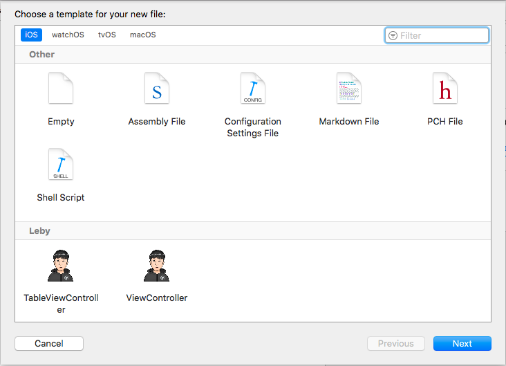
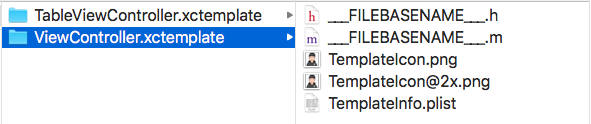
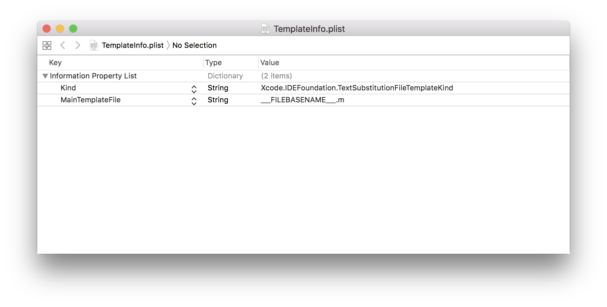
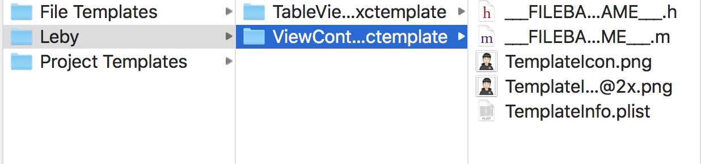
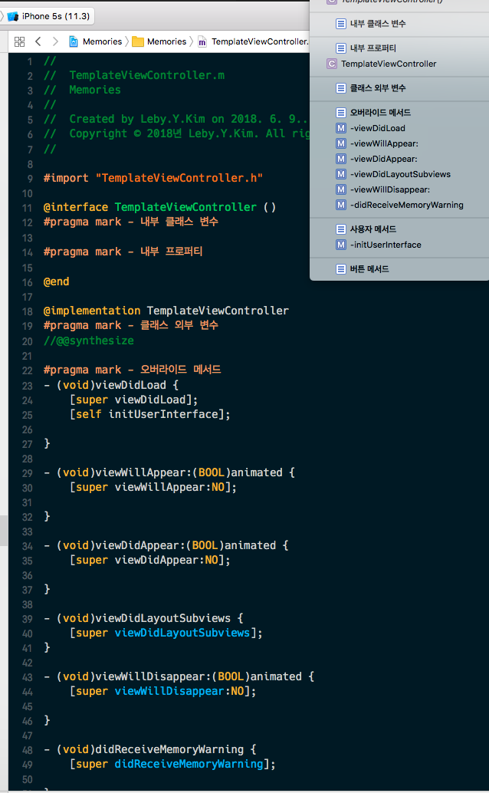

# Template New File  만들기




오늘은 iOS 스터디에서 배운 iOS New File Template 만들기에 대해서 정리하려고 한다.

iOS Template이 무엇인가? 내가 사용하기 편리하게 미리 `Override Method`나 `pragma mark`를 구분을 지어놓고

그렇게 만들어 놓은 템플릿을 그대로 가져와서 사용할 수 있다. 

<br />

**템플릿을 만들어 놓으면 좋은 장점**

- 개발 속도가 빨라진다. 미리 만들어 놓은 템플릿을 이용하기 때문에 입력하는 Source의 양이 줄어든다.
- 편리하다. 미리 필요한 부분들을 모두 구현해놓았기 때문에 그냥 사용하면 된다.

<br />

<br />

# 템플릿 생성 방법

템플릿을 사용하기 위해서는 아래와 같은 파일들이 필요합니다.



<br />

먼저 템플릿의 폴더의 이름을 정해준다. `ViewController.xctemplate` 

ViewController에 대해 템플릿을 만들어서 다음과 같이 지었다. 여기서 **중요한 점**은 폴더의 이름을 .xctemplate으로

하지 않으면 나중에 Xcode에서 보이지 않는다. 꼭 이름 뒤에 `.xctemplate` 확장자를 붙여주어야 한다.

.h파일과 .m파일의 이름은 FILEBASENAME로 무조건 해주어야한다. (Xcode 명령)

화면에 보여질 이미지를 저장하고 .plist의 파일도 작성해야 한다.

````objc
//__FILEBASENAME__.h
#import <UIKit/UIKit.h>

@interface ___FILEBASENAMEASIDENTIFIER___ : UIViewController

#pragma mark - 외부 클래스 변수

#pragma mark - 외부 프로퍼티

@end
````

````objc
//__FILEBASENAME__.m
#import "___FILEBASENAME___.h"

@interface ___FILEBASENAMEASIDENTIFIER___ ()
#pragma mark - 내부 클래스 변수

#pragma mark - 내부 프로퍼티

@end

@implementation ___FILEBASENAMEASIDENTIFIER___
#pragma mark - 클래스 외부 변수
//@@synthesize

#pragma mark - 오버라이드 메서드
- (void)viewDidLoad {
    [super viewDidLoad];
    [self initUserInterface];
    
}

- (void)viewWillAppear:(BOOL)animated {
    [super viewWillAppear:NO];
    
}

- (void)viewDidAppear:(BOOL)animated {
    [super viewDidAppear:NO];
    
}

- (void)viewDidLayoutSubviews {
    [super viewDidLayoutSubviews];
}

- (void)viewWillDisappear:(BOOL)animated {
    [super viewWillDisappear:NO];
    
}

- (void)didReceiveMemoryWarning {
    [super didReceiveMemoryWarning];
    
}

#pragma mark - 사용자 메서드
- (void)initUserInterface {
    
}

#pragma mark - 버튼 메서드


@end
````




여기까지 만들면 템플릿을 설정할 파일을 모두 만든 것이다.

<br />

<br />

# 템플릿 적용

이제 만든 템플릿을 적용만 하면 Xcode에서 `File > New File` 제일 항목 아래에서 내가 만든 템플릿 파일을 볼 수 있다.

적용하는 방법은 Xcode의 패키지 내부에 포함 시키면 된다.

 `Xcode 패키지 내용 보기` 로 폴더로 접근하는 방법과 `터미널`을 이용해서 접근하는 방법이다.

나는 터미널을 이용해서 템플릿을 적용시켰다. 옮길 경로는 다음과 같다.

~~~~bash
/Applications/Xcode.app/Contents/Developer/Library/Xcode/Templates
~~~~

이 경로에서 Leby라는 폴더를 만들었고, 아까 만든 템플릿 폴더를 안에 넣어두었다.



여기까지 설정이 끝났으면 이제 Xcode에서 `File > New File`을 생성할 때 다음과 같이 보여지는 것을 확인할 수 있다.


실제로 파일을 생성해서 안에 내용을 보면 다음과 같이 보인다.



<br />

이렇게 만들어 놓으니까 벌써부터 개발 속도가 빨라질 것 같아 기분이 좋다.

템플릿은 꼭 ViewController 뿐만 아니라 모델(DTO or VO) 객체에 적용하는 것도 엄청난 시너지가 생길 것 같다.

잘 사용한다면 엄청나게 편리하게 개발을 할 수 있을 것 같다.