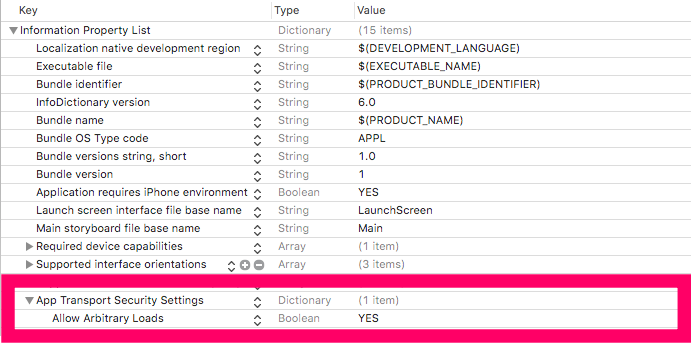

# iOS 9 이상 네트워크 설정

네트워크 사용하는 앱에서는 반드시 다음 설정을 해야 한다. iOS 9 업데이트 되면서 보안관련 정책사항에 변화가 생겼다.

iOS 9 이상부터는 앱에서 네트워크를 사용할 때 설정을 안해주면 다음과 같은 에러가 발생한다.

~~~~objective-c
Transport security has blocked a cleartext HTTP (http://) resource load since it is
insecure. Temporary exceptions can be configured via your app's Info.plist file.
~~~~

# 해결 방법 (Source Code)

Xcode 프로젝트에 **info.plist** 파일을 우클릭 -> Open As -> Source Code로 편집하면 된다.

<Key></Key>

<dict></dict>

xml 포맷에 맞게 아래 부분에 추가해주면 된다.

~~~~xml
<key>NSAppTransportSecurity</key> 
<dict>
        <key>NSAllowsArbitraryLoads</key> 
        <true/>
</dict> 
~~~~

이렇게 하면 끝.

