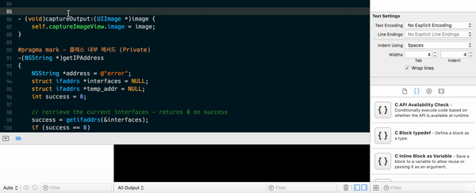
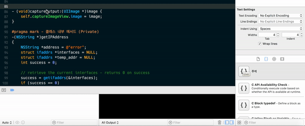
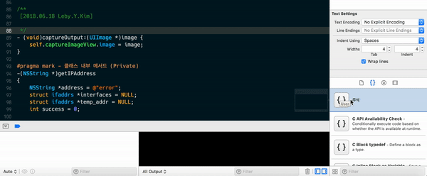

# 개발 시간을 절약할 수 있는 Xcode 코드 스니펫

오늘은 스터디에서 배운 코드 스니펫을 정리하려고 한다.

코드 스니펫이란? Snippet이란 단어는 작은 조각이란 뜻이다. 코드 작은 조각?

코드 스니펫은 자주 사용하는 코드나 미리 정의되서 사용되는 여러 코드들의 대해 미리 정의해주는 기능이다.

~~~~06.
/**
 [2018.06.14 Leby.Y.Kim]
 
 */
~~~~

예를 들어 프로젝트에서 <u>매번 주석을 작성할 때마다 다시 쓰거나, 아니면 복사해서 붙여넣는다면 엄청 불편하다.</u>

하지만 코드 스니펫에 저 주석을 저장 해놓는다면 **comment**라는 글자만 입력해도 위 주석을 바로 사용할 수 있다.

 

 

# 코드 스니펫 추가

먼저 코드 스니펫에 추가하려는 코드를 작성한다.

~~~~objc
/**
 [2018.06.14 Leby.Y.Kim]
 
 */
~~~~

위 같이 코드를 작성하고 드래그를 하고 마우스를 끌어서 <u>드래그 앤 드롭 방식</u>으로 오른쪽 코드 스니펫 항목으로 옮긴다.

<u>코드를 드래그하고 바로 옮기려고 하면 드래그가 풀려버리니 1초 정도 기다리고 드래그하면 된다.</u>

**Title:** 코드 스니펫 이름 (주석)

**Completion Shortcut :** 코드 스니펫 숏컷 이름 (comment)

 

 

# 코드 스니펫 사용

이렇게 하면 코드 스니펫을 추가하고 위에서 지정해준 숏컷 이름(comment)를 입력하면 주석이 바로 생성된다.

 

 

# 코드 스니펫 기능

~~~objc
/**
 [2018.<#06#>.<#14#> Leby.Y.Kim]
 
 */
~~~

주석에 보면 날짜 항목이 있는데, 날짜는 매번 변경되는 부분이므로 문자를 <u><# #></u>을 감싸놓으면 편집 항목으로 변경된다.

 

 

# 결론

지금까지 봤듯이 코드 스니펫을 상황에 맞게 잘 사용한다면 개발 속도가 엄청나게 빨라질 것 같다는 생각이 든다.