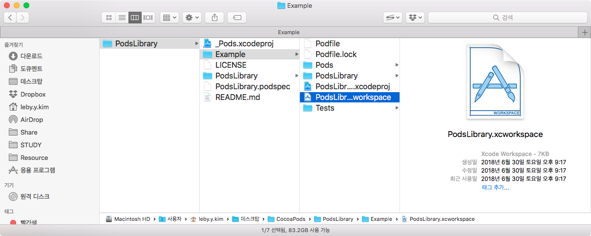
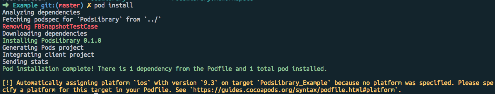
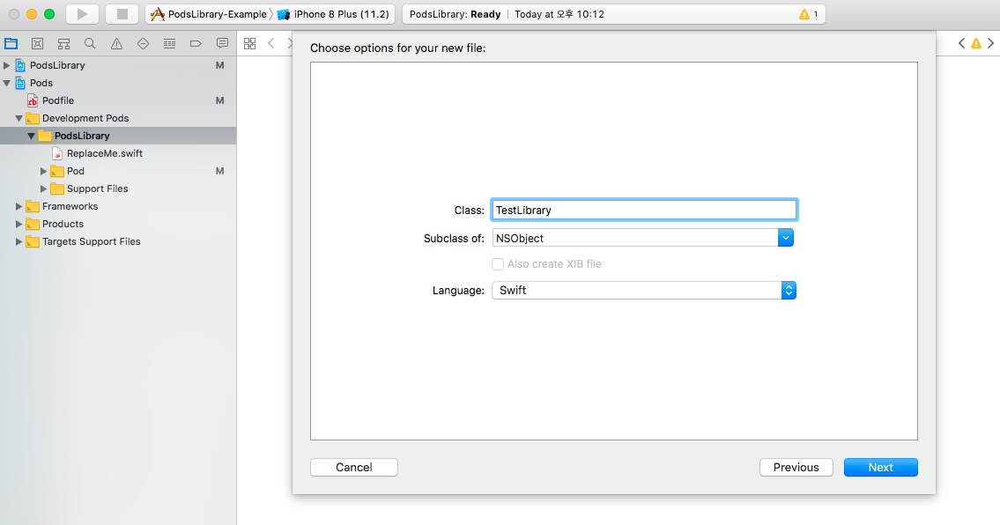
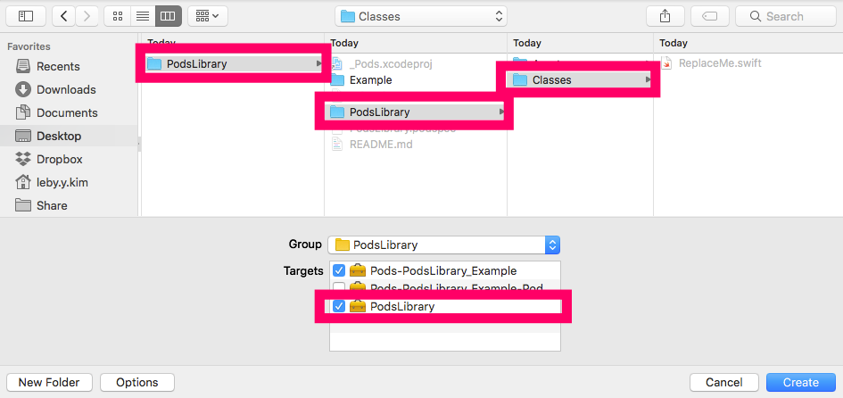
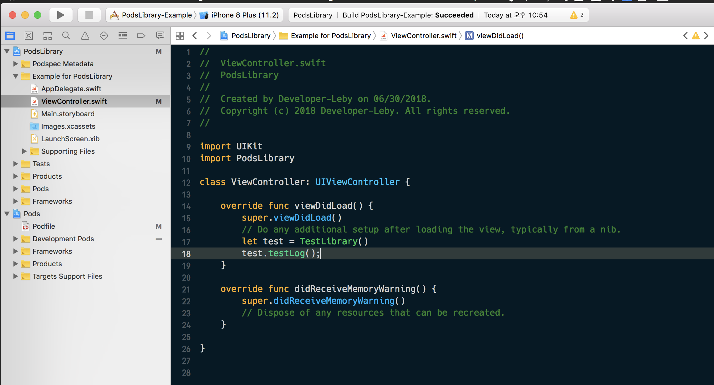
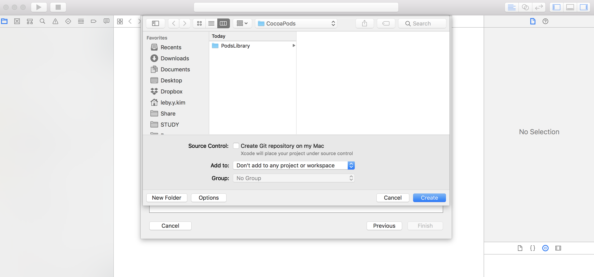
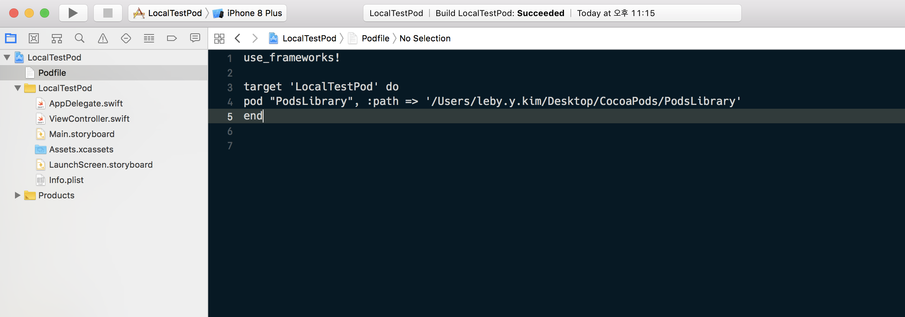
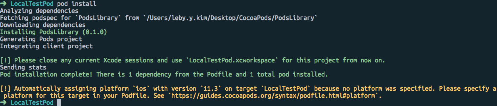

# 로컬 프로젝트에 직접 만든 Pod 생성 및 적용하기

안녕하세요. 레비입니다. 이번에는 직접 만든 라이브러리를 **Local Pods**로 **만드는 방법**에 대해서 정리하려고 합니다.

cocoapods는 iOS에서 Objective-C, Swift 라이브러리를 설치 및 배포할 수 있도록 도와주는 **의존성 관리 도구**입니다. 일반적으로 사용하는 목적은 다른 개발자가 만든 라이브러리를 사용할 목적으로 사용되지만, 오픈소스에 기여하거나 자신이 필요한 코드들을 모아두고 여러 프로젝트에서 쉽게 사용할 목적으로 등록하기도 합니다.

<br />

**그럼 진행하기에 앞서 먼저 준비되어야 할 항목들이 있습니다. 준비되지 않았다면 진행이 불가합니다.**

- cocoapods 설치 및 사용 방법을 익히셔야 합니다. [cocoapods 설치 및 사용 방법](http://www.developer-leby.kim/125)

<br />

먼저 cocoapods에 Library를 등록하기 전에 로컬 환경에서 라이브러리가 정상적으로 동작하는지 테스트를 해봐야 합니다. 그러기 위해서는 먼저 로컬에 Pod 라이브러리 프로젝트를 만들고 라이브러리를 적용시킬 수 있는 프로젝트를 생성해서 적용해봐야 합니다. 일단 Pod 라이브러리는 Swift 4.1 기준으로 진행하도록 하겠습니다.

<br />

# pod lib 폴더 생성

먼저 데스크탑에 새폴더로 CreatePods라는 폴더를 생성하도록 하겠습니다. 그리고 터미널(**Launchpad** > **기타** > **터미널**)을 실행시켜 바탕화면 경로로 이동합니다. 폴더를 터미널에 드래그 앤 드롭하면 폴더 경로가 나옵니다.

~~~bash
$ cd /Users/leby.y.kim/Desktop/CocoaPods
~~~

<br />

CocoaPods 폴더로 이동하여 다음 명령어를 입력해서 pod lib 파일을 생성해주세요.

~~~bash
$ pod lib create (생성할 프로젝트 라이브러리 이름)
~~~

다음과 같이 입력을 하면 라이브러리를 만들게 되는데, 이때 어느 형태로 라이브러리를 생성할지를 물어봅니다. 물어보는 항목에 맞춰서 입력을 해주면 최종적으로 pod lib로 만든 라이브러리 폴더가 생성됩니다.

~~~bash
What platform do you want to use?? [ iOS / macOS ]
 > iOS

What language do you want to use?? [ Swift / ObjC ]
 > Swift

Would you like to include a demo application with your library? [ Yes / No ]
 > Yes

Which testing frameworks will you use? [ Quick / None ]
 > None

Would you like to do view based testing? [ Yes / No ]
 > Yes
~~~

lib 파일이 생성이 되면 자동으로 .xcworkspace 파일의 Xcode가 실행이 됩니다. 혹시라도 실행되지 않는다면 다음 경로로 이동하셔서 .xcworkspace 파일을 실행주시면 됩니다.



Xcode에서 빌드 성공을 하는지 확인합니다.

<br />

# Podfile 변경

Xcode로 이동하여 좌측 네비게이션 항목에 Pods 프로젝트를 더블클릭하면 바로 아래 쪽에 Podfile을 열어 다음과 수정합니다.

```objc
use_frameworks!

target 'PodsLibrary_Example' do
  pod 'PodsLibrary', :path => '../'

  target 'PodsLibrary_Tests' do
    pod 'PodsLibrary', :path => '../'
  end
end
```

<br />

# 프로젝트 Pod install 하기

터미널 라이브러리 폴더로 이동하고  `Example` 폴더로 이동해서 다음과 같은 명령어를 입력합니다. 

(경로: /Users/leby.y.kim/Desktop/CocoaPods/PodsLibrary/Example)

```bash
$ pod install
```



위와 같이 진행하면 Pod가 설치 되었습니다.

<br />

# 라이브러리 소스 파일 만들기

프로젝트로 이동해서 빌드를 먼저해보고 이상이 없으면 새로운 파일을 만드는 것을 따라해보세요.



PodsLibrary에서 오른쪽 클릭 > New File… 선택하고 TestLibrary 클래스 파일을 만듭니다. 그리고 경로를 잡아줄 때 중요합니다. 이 부분이 제대로 안되면 추후 Podfile 로컬로 테스트 에러가 생깁니다.



PodsLibrary > PodsLibrary > Classes 경로에 파일을 생성하고, 아래 Targets 링크를 PodsLibrary를 체크해야 합니다. 파일을 생성하고 아래와 같이 입력을 하고 빌드를 하면 됩니다.

```swift
import UIKit

public class TestLibrary: NSObject {
    public func testLog() {
        NSLog("테스트 로그 함수가 실행되었습니다.")
    }
}
```

<br />

# 라이브러리 테스트 실행



Example for PodsLibrary 폴더로 이동해서 ViewController.swift 에 다음과 같이 import 시키고 빌드를 해봅니다.

~~~~swift
import UIKit
import PodsLibrary

class ViewController: UIViewController {

    override func viewDidLoad() {
        super.viewDidLoad()
        // Do any additional setup after loading the view, typically from a nib.
        let test = TestLibrary()
        test.testLog();
    }

    override func didReceiveMemoryWarning() {
        super.didReceiveMemoryWarning()
        // Dispose of any resources that can be recreated.
    }

}
~~~~

빌드가 정상적으로 된다면 이제 로컬에 있는 다른 프로젝트에 적용시킬 준비가 끝났습니다.

<br />

# 새로운 로컬 프로젝트 생성

Xcode > File > New > Project… 선택 LocalTestPod 프로젝트를 생성하고 CocoaPods폴더 경로로 지정합니다.



새 프로젝트를 생성을 하고 New File... > Empty File > Podfile을 생성하고 다음과 같이 입력합니다.



~~~bash
use_frameworks!

target 'LocalTestPod' do
pod "PodsLibrary", :path => '/Users/leby.y.kim/Desktop/CocoaPods/PodsLibrary'
end
~~~

pod 설정을 하는건데 path의 경로는 아까 라이브러리를 만들었던 경로를 지정해줬습니다. 이제 터미널에서 LocalTestPod 경로의 이동을 해서 다음 명령어를 입력해주세요.

~~~bash
$ pod install
~~~



정상적으로 Pod가 설치되는 것을 확인할 수 있습니다. 이제 .xcworkspace로 다시 Xcode 프로젝트를 실행하고 빌드를 하고 아까처럼 라이브러리를 import시키고 확인해보면 됩니다.

<br />

# 주의사항

- .xcworkspace 확장자로 Xcode를 열지 않으면 라이브러리가 나오지 않습니다. 꼭 .xcworkspace로 열어주어야 합니다.
- 빌드를 하지 않으면 import 할 라이브러리가 나오지 않으니 필수적 빌드를 성공해야 합니다.

<br />

# 로컬 라이브러리 실행

~~~swift
import UIKit
import PodsLibrary

class ViewController: UIViewController {

    override func viewDidLoad() {
        super.viewDidLoad()
        // Do any additional setup after loading the view, typically from a nib.
        let test = TestLibrary()
        test.testLog();
    }

    override func didReceiveMemoryWarning() {
        super.didReceiveMemoryWarning()
        // Dispose of any resources that can be recreated.
    }


}
~~~

아까와 같이 라이브러리 테스트 코드를 입력하면 실행이 되는 것을 확인할 수 있습니다. 지금까지 pod 라이브러리를 만들어 로컬에 있는 프로젝트에 적용하는 방법에 대해서 알아봤습니다. 다음은 CocoaPods에 라이브러리 등록하는 방법에 대해 포스팅 하도록 하겠습니다. 고생하셨습니다~!