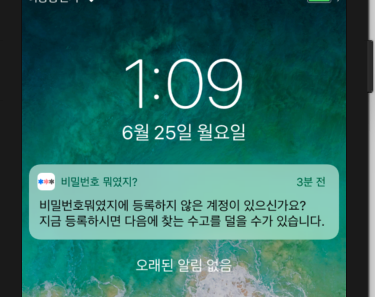

# 매일 특정 시간에 알림 구현 (UILocalNotification)

iOS에서 매일 특정 시간에 알림을 받을 수 있는 방법에 대해서 정리하려고 한다.

Notification 알림은 크게 2가지로 나뉜다.

**첫 번째는, APNS 서버에서 데이터를 전달받아 띄우는 Notification 알림**

**두 번째는, 앱 자체에서 띄우는 Local Notification 알림**

매일 특정 시간에 Nofitication 알림을 띄우는 방법은 두 번째 방법을 이용해서 구현한다.

 

 

# AppDelegate 메서드 구현

~~~~objective-c
-(void)application:(UIApplication *)application didReceiveLocalNotification:(UILocalNotification *)notification
{
    if(application.applicationState == UIApplicationStateActive){
        
        // Foreground에서 알림 수신
    }
    
    if(application.applicationState == UIApplicationStateInactive){
        
        // Background에서 알림 액션에 의한 수신
        // notification.userInfo 이용하여 처리
    }
}
~~~~

AppDelegate에 다음 메서드를 구현해야한다.

로컬 알림을 받았을 때의 앱이 `포그라운드` 상태인지, `백그라운드` 상태인지에 따라 분기하여 처리할 수 있다.

iOS 8+ 부터는 `UILocalNotification`을 사용하려면 `didRegisterUserNotificationSettings` 메서드를 구현해줘야 한다.

~~~objc
- (void)application:(UIApplication *)application didRegisterUserNotificationSettings:(UIUserNotificationSettings *)notificationSettings {
    
}
~~~

 

 

# UILocalNotification 사용하기

기본적인 셋팅이 끝났고 이제 사용하는 곳으로 이동해서 다음 함수를 구현한다.

**Notification 등록 메서드**

~~~objective-c
- (void)registerLocalNotification {
    [[UIApplication sharedApplication] cancelAllLocalNotifications];
    
    // iOS 8 이후부터는 UILocalNotification 을 사용하기 위해 아래의 registerUserNotificationSettings 메서드를 사용하여 Setting값을 등록해 주어야 한다.
    UIUserNotificationType types = UIUserNotificationTypeBadge | UIUserNotificationTypeSound | UIUserNotificationTypeAlert;
    UIUserNotificationSettings *mySettings = [UIUserNotificationSettings settingsForTypes:types categories:nil];
    [[UIApplication sharedApplication] registerUserNotificationSettings:mySettings];
    
    // 현재 날짜를 가져온다.
    NSCalendar *calendar = NSCalendar.currentCalendar;
    NSDateComponents *components = [calendar components:(NSCalendarUnitDay | NSCalendarUnitMonth | NSCalendarUnitYear) fromDate:[NSDate date]];

    NSDateComponents *dateComponents = [[NSDateComponents alloc] init];
    dateComponents.day = components.day;
    dateComponents.month = components.month;
    dateComponents.year = components.year;
    dateComponents.hour = 20;
    dateComponents.minute = 00;
    
    // 설정한 시간을 NSDate 형태로 변경
    NSDate *date = [calendar dateFromComponents:dateComponents];
    
    UILocalNotification *noti = [[UILocalNotification alloc]init];
    // 알람 발생 시각 설정. NSDate 타입.
    noti.fireDate = date;
    // 알림 메시지 설정
    noti.alertBody = @"비밀번호뭐였지에 등록하지 않은 계정이 있으신가요?\n지금 등록하시면 다음에 찾는 수고를 덜을 수가 있습니다.";
    // timeZone 설정.
    noti.timeZone = [NSCalendar currentCalendar].timeZone;
    // 반복 설정
    noti.repeatInterval = NSCalendarUnitDay;
    // 알림 액션 설정
    noti.alertAction = @"GOGO";
    // 아이콘 뱃지 넘버 설정. 임의로 1 입력
    noti.applicationIconBadgeNumber = 1;
    // 알림 사운드 설정. 자체 제작 사운드도 가능. (if nil = no sound)
    noti.soundName = UILocalNotificationDefaultSoundName;
    // 임의의 사용자 정보 설정. 알림 화면엔 나타나지 않음
    noti.userInfo = [NSDictionary dictionaryWithObject:@"My User Info" forKey:@"User Info"];
    // UIApplication을 이용하여 알림을 등록.
    [[UIApplication sharedApplication] scheduleLocalNotification:noti];
}
~~~

위에 처럼 구현을 하면 매일 20시에 Local Notification이 발생한다. 

iOS 8+ 부터는 `UIUserNotificationSettings`을 셋팅을 해줘야 한다. 그러지 않으면 알림이 발생하지 않는다.

`noti.repeatInterval = NSCalendarUnitDay;` 이 부분이 어떤식으로 반복할지 설정하는 부분이다.

 

**Notification 해제 메서드**

~~~objective-c
- (void)cancelLocalNotification {
    [[UIApplication sharedApplication] cancelAllLocalNotifications];
}
~~~

 

위와 같이 Notification 등록, 해제 메서드를 구현해놓고 iOS에서 스위치 컴포넌트를 이용해서 상태에 따라 메서드를 호출하면 된다.

**ON**: Notification 등록 메서드 호출

**OFF**: Notification 해제 메서드 호출

첫재는