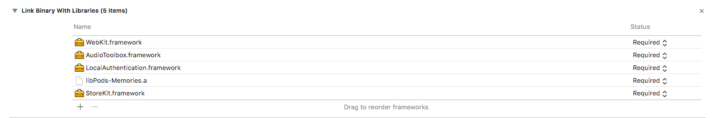
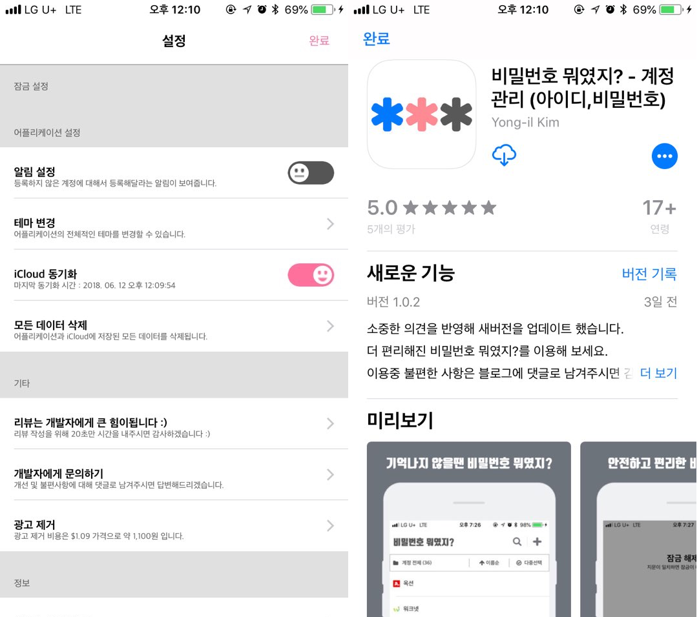

# 앱스토어 모달창으로 보여주기

iOS 어플리케이션을 구현하다 보면 리뷰나, 다운로드를 유도하는 상황이 생긴다.

그럴 경우 아래와 같은 코드를 이용해 앱스토어로 이동시킨다.

~~~~objc
NSString *appUrl = @"https://itunes.apple.com/kr/app/%EB%B9%84%EB%B0%80%EB%B2%88%ED%98%B8-%EB%AD%90%EC%98%80%EC%A7%80-%EA%B3%84%EC%A0%95-%EA%B4%80%EB%A6%AC-%EC%95%84%EC%9D%B4%EB%94%94-%EB%B9%84%EB%B0%80%EB%B2%88%ED%98%B8/id1392239856?mt=8";
[[UIApplication sharedApplication] openURL:[NSURL URLWithString:appUrl]];
~~~~

 

하지만 이런 경우에는 현재 앱에서 앱스토어 앱간 전환이 되버리기 때문에 사용자에게 부담이 될 수 있다.

iOS 6.0+ 부터 제공하는 `SKStoreProductViewController`를 사용하면 앱스토어 링크의 이동을 모달 뷰로 띄울 수 있다.

 

 

# StoreKit.Framework 추가

먼저 `SKStoreProductViewController`를 사용하기 위해서는 `StoreKit.framework`를 추가해야 한다.

**프로젝트 > Build Phases > Link Binary With Libraries** 

 

 

# SKStoreProductViewController 사용

~~~~objc
// ViewController.h
#import <UIKit/UIKit.h>
#import <StoreKit/StoreKit.h>
 
@interface ViewController : UIViewController <SKStoreProductViewControllerDelegate>
 
@end
~~~~

#import <StoreKit/StoreKit.h>를 포함시키고 SKStoreProductViewControllerDelegate를 추가한다.

 

~~~objc
// ViewController.m
- (IBAction)linkToAppstoreWithUrl:(id)sender {
    // 기존의 방식으로 앱스토어 이동을 위한 링크
    NSString *appUrl = @"https://itunes.apple.com/kr/app/%EB%B9%84%EB%B0%80%EB%B2%88%ED%98%B8-%EB%AD%90%EC%98%80%EC%A7%80-%EA%B3%84%EC%A0%95-%EA%B4%80%EB%A6%AC-%EC%95%84%EC%9D%B4%EB%94%94-%EB%B9%84%EB%B0%80%EB%B2%88%ED%98%B8/id1392239856?mt=8";
    
    // iOS 6.0이상에서 SKStoreProductViewController를 이용하기 위한 어플리케이션 아이디
    NSString *appId = @"1392239856";
    
    // SKStoreProductViewController를 사용할 수 있는지 여부 확인
    if(NSClassFromString(@"SKStoreProductViewController")) {
        SKStoreProductViewController *storeController = [[SKStoreProductViewController alloc] init];
        storeController.delegate = self;
        NSDictionary *productParameters = @{ SKStoreProductParameterITunesItemIdentifier : appId };

        [storeController loadProductWithParameters:productParameters completionBlock:^(BOOL result, NSError *error) {
            if (result) {
                // 정상적으로 링크를 열 수 있을 때
                [self presentViewController:storeController animated:YES completion:nil];
            } else {
                // 앱스토어 링크 열 때 오류 발생
                // 알림창 출력
            }
        }];
    } else {
        [[UIApplication sharedApplication] openURL:[NSURL URLWithString:appUrl]];
    }
}

- (void)productViewControllerDidFinish:(SKStoreProductViewController *)viewController
{
    // 앱스토어 모달창에서 사용자가 취소버튼을 눌렀을 때 취할 행동 구현, 창을 닫는다.
    [viewController dismissViewControllerAnimated:YES completion:nil];
}
~~~

iOS 6.0 미만 버전에서도 정상적으로 동작하도록 하기 위해 `SKStoreProductViewController`를 지원하지 않으면

기존 동작인 OpenURL을 이용하여 동작하도록 했다. 

loadProductWithParameters:productParameters completionBlock 이 메서드를 호출하면 앱스토어의 정보를

읽어오고 이 과정이 끝나면  코드 블럭 안으로 result 값을 처리한다.

이렇게 구현을 하게 되면 앱간 전환이 아니라 앱에서 단순 화면 전환으로 앱스토어로 이동시킬 수 있다.

  

# 실행 화면

