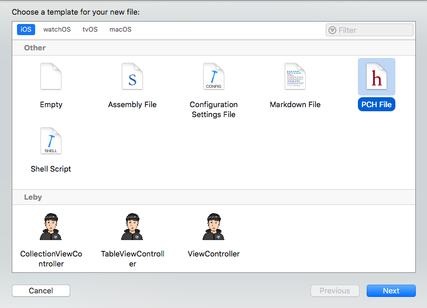
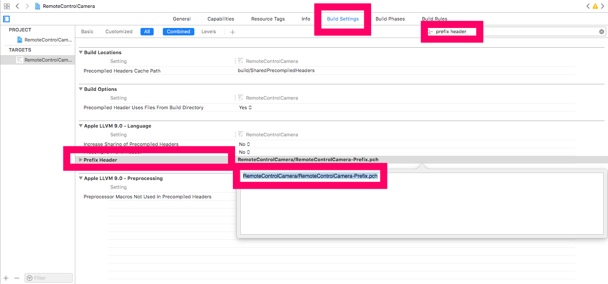

# 프로젝트 prefix .pch 파일 설정

prefix란? 무엇이냐면 프로젝트 전체에 적용되는 설정이라고 생각하면 된다.

예를 들어 **앱 전체 프로젝트에 해당되는 `define` 값이 있다면** `define.h` 파일을 만들어서 따로 관리해도 되지만,

그렇게 되면 프로젝트마다 `define.h ` 파일을 **매번 `#import` 시켜야하는 불편함**이 있다.

 

이럴 때 **prefix 파일을 만들고 `define` 값을 넣고 사용한다면 조금더 유연하게 프로젝트 관리**가 가능하다.

prefix 파일의 확장자는 `.pch` 파일이고 파일명은 원하는데로 만들어도 된다.

 

 

# .pch (prefix파일) 생성하기

**프로젝트 오른쪽 마우스 클릭 > New File... > Other > PCH File 생성**

이름은 원하는 이름으로 설정해도 상관없다.

`RemoteControlCamera-Prefix.pch` 파일을 만들고 거기에 다음과 같이 앱 전체에 적용되는 값을 넣어줍니다.

~~~objc
//
//  RemoteControlCamera-Prefix.pch
//  RemoteControlCamera
//
//  Created by Leby.Y.Kim on 2018. 6. 26..
//  Copyright © 2018년 Leby.Y.Kim. All rights reserved.
//

#ifndef RemoteControlCamera_Prefix_pch
#define RemoteControlCamera_Prefix_pch

// Include any system framework and library headers here that should be included in all compilation units.
// You will also need to set the Prefix Header build setting of one or more of your targets to reference this file.

#define APP_TITLE @"앱 타이틀"

#endif /* RemoteControlCamera_Prefix_pch */

~~~

위와 같이 #define 항목을 만들어 놓고 사용하면 된다. 그러면 APP_TITLE은 프로젝트 어느 곳에서도 사용이 가능하다.

마지막 하나가 남았다. 생성한 prefix 파일의 경로를 프로젝트에서 잡아줘야 한다.

 

 

# .pch (prefix파일) 경로 설정

프로젝트 설정으로 이동한다.

**Build Settings > 검색창에 prefix header > RemoteControlCamera/RemoteControlCamera-Prefix.pch**

위와 같이 Path 설정을 해주면 프로젝트 어디서든 prefix 값을 사용할 수 있다.

